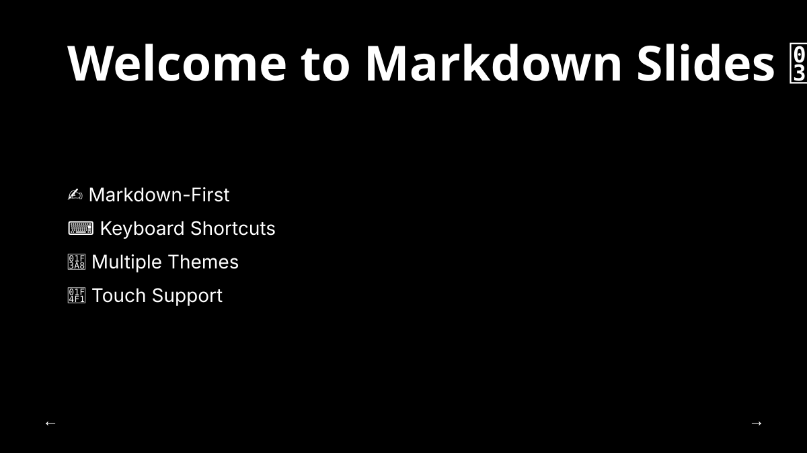
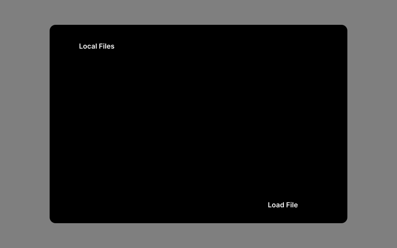
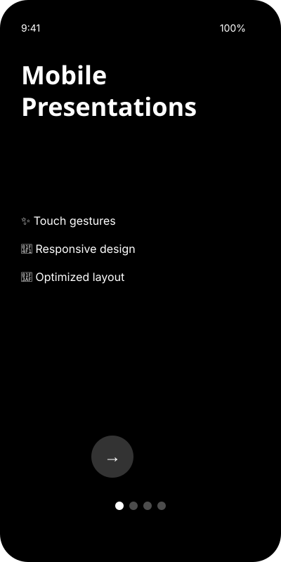
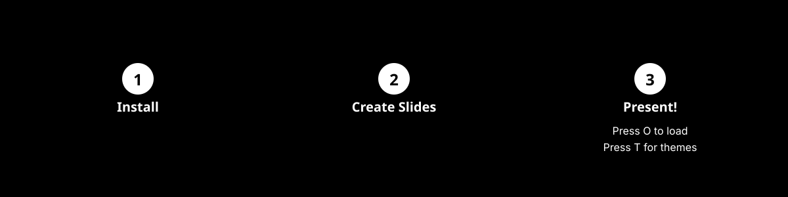

# Markdown Slides 🎯

<div align="center">

A powerful full-screen presentation system that transforms markdown files into beautiful slide presentations. Built with React, TypeScript, and Tailwind CSS.

[](https://github.com/yourusername/markdown-slides/actions/workflows/ci.yml)
[](https://github.com/yourusername/markdown-slides/actions/workflows/release.yml)
[](https://github.com/yourusername/markdown-slides/actions/workflows/deploy.yml)
[](./LICENSE)
[](https://react.dev/)
[](https://www.typescriptlang.org/)
[](https://github.com/yourusername/markdown-slides/releases)
[](https://www.npmjs.com/package/markdown-slides)

[Quick Start](#-quick-start) • [Features](#-features) • [Documentation](./docs/README.md) • [Examples](#-usage-guide)



</div>

> **📚 Documentation**: All documentation is organized in the [`docs/`](./docs/) directory. See the [Documentation Index](./docs/README.md) for the complete guide.

## ✨ Features

<table>
<tr>
<td width="50%">

### 🎨 Beautiful Themes
Switch between 6 carefully crafted themes with light/dark modes. Each theme features unique typography and color palettes designed for maximum readability.


</td>
<td width="50%">

### 📂 Flexible Loading
Load presentations from local files or directly from Git URLs (GitHub/GitLab). No downloads needed.



</td>
</tr>
<tr>
<td width="50%">

### ⌨️ Keyboard Shortcuts
Lightning-fast navigation with intuitive keyboard shortcuts. Press `?` to see all available shortcuts.


</td>
<td width="50%">

### 📱 Mobile Optimized
Fully responsive design with touch gestures. Swipe to navigate, pinch to zoom.



</td>
</tr>
</table>

### Complete Feature List

- 📝 **Markdown-First** - Write slides in familiar markdown syntax
- ⌨️ **Keyboard Shortcuts** - Lightning-fast navigation with intuitive shortcuts
- 📱 **Touch Support** - Swipe gestures on mobile devices
- 🎨 **Multiple Themes** - 6 beautiful color schemes with light/dark modes
- 📂 **Flexible Loading** - Load from local files or Git URLs (GitHub/GitLab)
- ⏱️ **Presentation Timer** - Track your presentation time with pause/resume
- 🔍 **Slide Search** - Quick navigation with searchable slide list
- 📤 **PDF Export** - Export your presentation to PDF with one click
- ✨ **Smooth Transitions** - Polished animations and directional effects
- 🌐 **Cross-Platform** - Works on desktop, tablet, and mobile
- 🚀 **CLI Ready** - Run with npm or npx without installation
- 🎯 **Fullscreen Mode** - Distraction-free presenting experience

---

### Why Markdown Slides?

<div align="center">


**Built for developers, by developers.** Version control your presentations, collaborate with Git, and present with confidence.

</div>

## 🎬 Demo & Screenshots

<div align="center">

### Visual Feature Overview


### See It In Action

The images above are SVG placeholders showing the features. To generate actual screenshots:

```bash
# Start the development server
npm run dev

# In another terminal, run the screenshot helper
chmod +x .github/screenshots/generate-screenshots.sh
.github/screenshots/generate-screenshots.sh
```

Or follow the [Screenshot Instructions](./.github/screenshots/INSTRUCTIONS.md) to manually capture images, or view the [Visual Guide](./docs/getting-started/VISUAL_GUIDE.md) for detailed feature examples.

</div>

## 📋 Prerequisites

- Node.js 18.x or higher
- npm 8.x or higher

## 🚀 Quick Start

<div align="center">



</div>

### Option 1: Run Locally (Development)

For contributors or local testing:

```bash
# Clone the repository
git clone https://github.com/abudhahir/markdown-slides-presenter.git
cd markdown-slides-presenter

# Install dependencies
npm install

# Start development server with hot reload
npm run dev
```

The application will be available at `http://localhost:5173`

### Option 2: Test the Production Build Locally

Build and run the production version:

```bash
# Build for production
npm run build

# Run the built version
npm run start
```

Open your browser to `http://localhost:3000` and start presenting!

See the **[Testing and Local Deployment Guide](./docs/getting-started/TESTING_AND_LOCAL_DEPLOYMENT.md)** for comprehensive testing instructions.

### Option 3: Using npx (No Installation - After Publishing)

Once published to npm, users can run instantly without installing:

```bash
# Stable version
npx markdown-slides-presenter

# Pre-release versions (for testing)
npx markdown-slides-presenter@beta
npx markdown-slides-presenter@alpha
```

### Option 4: Global Installation (After Publishing)

After publishing to npm, install globally to use anywhere:

```bash
# Install stable version globally
npm install -g markdown-slides-presenter

# Or install pre-release for testing
npm install -g markdown-slides-presenter@beta
npm install -g markdown-slides-presenter@alpha

# Run from anywhere
markdown-slides
```

### CLI Options

```bash
# Run on default port 3000
markdown-slides

# Run on custom port
markdown-slides --port 8080
markdown-slides -p 5000

# Show help
markdown-slides --help

# Show version
markdown-slides --version
```

For complete CLI documentation, see the [CLI Usage Guide](./docs/getting-started/CLI_USAGE_GUIDE.md).

## 🚢 Releases & Publishing

This project uses **fully automated** releases with GitHub Actions. Each release automatically includes:

- 📦 **GitHub Release** with changelog and build artifacts
- 🌐 **GitHub Pages Deploy** - Live demo updated instantly
- 📤 **npm Publication** - Package published to npm registry automatically
- 🐳 **Docker Image** - Container published to GHCR
- ✅ **Version Management** - Semantic versioning enforced

### 🚀 Quick Release (Automated npm Publishing)

**Just push a tag** - Everything else is automatic!

```bash
# Stable release
git tag v1.0.0
git push origin main
git push origin v1.0.0

# Pre-release (beta/alpha/rc)
git tag v1.2.0-beta.1
git push origin v1.2.0-beta.1

# That's it! The workflow automatically:
# ✅ Builds the application
# ✅ Creates GitHub release
# ✅ Publishes to npm (with correct tag)
# ✅ Deploys to GitHub Pages (stable only)
# ✅ Builds Docker image
```

### 🔖 Pre-Release Support

Pre-releases are fully supported for testing before stable releases:

| Version Type | Tag Format | npm Tag | Install Command |
|-------------|------------|---------|-----------------|
| **Alpha** | `v1.2.0-alpha.1` | `alpha` | `npm install markdown-slides-presenter@alpha` |
| **Beta** | `v1.2.0-beta.1` | `beta` | `npm install markdown-slides-presenter@beta` |
| **Release Candidate** | `v1.2.0-rc.1` | `rc` | `npm install markdown-slides-presenter@rc` |
| **Stable** | `v1.2.0` | `latest` | `npm install markdown-slides-presenter` |

**Key Points:**
- Pre-releases won't affect stable users (they use different npm tags)
- GitHub Pages only deploys for stable releases
- Perfect for testing new features before general availability

See **[Pre-Release Guide](./docs/release/PRERELEASE_GUIDE.md)** for detailed instructions.

### 📦 npm Publishing Setup

Before your first release, add your npm token to GitHub:

1. **Create npm token** at [npmjs.com/settings/tokens](https://www.npmjs.com/settings/tokens)
2. **Add to GitHub Secrets**: Settings → Secrets → New secret
   - Name: `NPM_TOKEN`
   - Value: Your npm access token

**That's all!** Future releases will automatically publish to npm.

See **[Automated npm Publishing Guide](./docs/release/AUTOMATED_NPM_PUBLISHING.md)** for complete setup instructions.

### Release Workflow Features

- ✅ **Automated Changelog** - Generated from commit messages
- ✅ **GitHub Release** - Created with assets and release notes
- ✅ **npm Auto-Publish** - Published to npm registry (with NPM_TOKEN)
- ✅ **GitHub Pages** - Live demo updated automatically
- ✅ **Docker Build** - Container published to GHCR
- ✅ **Version Validation** - Semantic versioning enforced
- ✅ **Build Verification** - Tested before publishing
- ✅ **Release Notes** - Updated with npm package info

### Using Releases

**Download build:**
```bash
# From GitHub releases
wget https://github.com/yourusername/markdown-slides/releases/download/v1.0.0/markdown-slides-v1.0.0-dist.tar.gz
tar -xzf markdown-slides-v1.0.0-dist.tar.gz
```

**Docker:**
```bash
# Pull and run
docker pull ghcr.io/yourusername/markdown-slides:latest
docker run -p 8080:80 ghcr.io/yourusername/markdown-slides:latest
```

**npm:**
```bash
# Install specific version
npm install markdown-slides@1.0.0
```

See [RELEASE_WORKFLOW.md](./docs/release/RELEASE_WORKFLOW.md) for complete documentation.

## 🛠️ Development Setup

### Project Structure

```
markdown-slides/
├── src/
│   ├── components/
│   │   ├── slides/          # Slide-related components
│   │   │   ├── SlidePresentation.tsx
│   │   │   ├── FileSelector.tsx
│   │   │   ├── ThemeSelector.tsx
│   │   │   ├── SlidesList.tsx
│   │   │   └── ...
│   │   └── ui/              # Shadcn UI components
│   ├── hooks/               # Custom React hooks
│   │   └── use-mobile.ts
│   ├── lib/                 # Utility functions
│   │   └── utils.ts
│   ├── styles/              # Global styles and themes
│   │   └── theme.css
│   ├── App.tsx              # Main application component
│   ├── index.css            # Theme definitions
│   └── main.tsx             # Entry point
├── examples/                # Example presentations
│   ├── tutorial.md
│   ├── technical-presentation.md
│   └── product-demo.md
├── public/                  # Static assets
├── index.html              # Entry HTML file
├── package.json            # Dependencies and scripts
├── vite.config.ts          # Vite configuration
└── tsconfig.json           # TypeScript configuration
```

### Available Scripts

```bash
# Start development server (port 5173)
npm run dev

# Build for production
npm run build

# Preview production build
npm run preview

# Run linting
npm run lint

# Optimize dependencies
npm run optimize

# Kill process on port 5000 (if needed)
npm run kill
```

### Development Tips

1. **Hot Module Replacement (HMR)**: Changes are reflected instantly during development
2. **TypeScript**: Full type safety with strict mode enabled
3. **ESLint**: Automatic code quality checks
4. **Tailwind CSS**: Utility-first styling with v4 features
5. **React 19**: Using the latest React features

### Adding New Themes

Edit `src/index.css` and add your theme configuration:

```css
:root {
  --background: oklch(0.98 0 0);
  --foreground: oklch(0.20 0 0);
  --primary: oklch(0.45 0.15 260);
  /* ... other color variables */
}
```

### Customizing Components

All UI components are in `src/components/ui/` (shadcn components) and custom components in `src/components/slides/`.

## 📦 Publishing to npm

This package is ready to be published to npm. See the [NPM Publishing Guide](./docs/release/NPM_PUBLISHING_GUIDE.md) for detailed instructions.

### Quick Publish Steps

1. **Update package.json with your details:**
   - Change `name` to your desired package name
   - Update `author`, `repository`, and `homepage` URLs
   - Ensure `version` is set correctly

2. **Build and test:**
   ```bash
   npm run build
   npm run start  # Test the CLI locally
   npm pack       # Create tarball for testing
   ```

3. **Login and publish:**
   ```bash
   npm login
   npm publish
   ```

4. **Verify publication:**
   ```bash
   npm view markdown-slides-presenter
   npx markdown-slides-presenter
   ```

### After Publishing

Users can install and run your package:

```bash
# Run without installing
npx markdown-slides-presenter

# Or install globally
npm install -g markdown-slides-presenter
markdown-slides
```

See [NPM_PUBLISHING_GUIDE.md](./docs/release/NPM_PUBLISHING_GUIDE.md) for complete publishing documentation.

## 🌐 Deployment

This project can be deployed to various platforms:

### GitHub Pages

Automated deployment using GitHub Actions. See [GITHUB_PAGES_DEPLOYMENT.md](./docs/deployment/GITHUB_PAGES_DEPLOYMENT.md) for detailed instructions.

### GitLab Pages

Deploy to GitLab Pages using GitLab CI. See [GITLAB_PAGES_DEPLOYMENT.md](./docs/deployment/GITLAB_PAGES_DEPLOYMENT.md) for instructions.

### Other Platforms

Deploy the `dist/` folder to any static hosting:
- **Netlify**: Connect your repo or drag-and-drop `dist/`
- **Vercel**: Import your git repository
- **AWS S3 + CloudFront**: Upload `dist/` to S3 bucket
- **Azure Static Web Apps**: GitHub integration available
- **Firebase Hosting**: `firebase deploy`

## 📖 Usage Guide

### Running as CLI

```bash
# Quick start with npx (no install)
npx markdown-slides-presenter

# Or install globally
npm install -g markdown-slides-presenter
markdown-slides

# Custom port
markdown-slides --port 8080

# Show help
markdown-slides --help
```

See the [CLI Usage Guide](./docs/getting-started/CLI_USAGE_GUIDE.md) for complete CLI documentation.

---

### Creating Slides

Slides are written in standard markdown, separated by `---`:

```markdown
# First Slide

Welcome to my presentation!

---

## Second Slide

- Point one
- Point two
- Point three

---

# Thank You!
```

---

### Keyboard Shortcuts

<div align="center">

| Key | Action | Key | Action |
|:---:|--------|:---:|--------|
| `→` `↓` | Next slide | `←` `↑` | Previous slide |
| `Space` | Next slide | `S` | Show slides list |
| `T` | Toggle theme | `O` | Open file selector |
| `D` | Display filename | `F` | Fullscreen |
| `?` | Show shortcuts | `Esc` | Exit/Close |

</div>

---

### Loading Presentations

<table>
<tr>
<td width="50%">

#### Local Files
1. Press `O` to open the file selector
2. Navigate to your markdown file
3. Click to load the presentation

</td>
<td width="50%">

#### Git URLs
1. Press `O` to open the file selector
2. Switch to the "Git URL" tab
3. Paste a GitHub or GitLab URL
4. Click "Load from Git"

**Supported formats:**
- `https://github.com/owner/repo/blob/main/slides.md`
- `https://gitlab.com/owner/repo/-/blob/main/slides.md`

</td>
</tr>
</table>

---

### Themes

<div align="center">

Choose from **6 carefully designed themes**, each with light and dark modes:

| Theme | Description | Best For |
|-------|-------------|----------|
| **Solarized** | Classic balanced color scheme | General presentations |
| **Dracula** | Popular dark theme with vibrant accents | Creative content |
| **Code Dark/Light** | Technical coding-friendly themes | Technical talks |
| **Midnight** | Deep indigo with cyan accents | Professional slides |
| **Forest** | Natural green tones | Environmental topics |
| **Sunset** | Warm browns and oranges | Warm, inviting talks |

Press `T` to open the theme selector and preview themes in real-time.

</div>

---

### Exporting to PDF

1. Navigate to your presentation
2. Click the **download icon** in the top-right corner
3. Wait for PDF generation
4. PDF will download automatically to your browser's download folder

> **Note**: Ensure all fonts and images are loaded before exporting for best results.

## 📚 Documentation & Resources

**📁 All documentation has been organized into the [`docs/`](./docs/) directory.** See the [Documentation Index](./docs/README.md) for the complete structure.

### Getting Started
- [README](./README.md) - Project overview and setup
- [Testing and Local Deployment Guide](./docs/getting-started/TESTING_AND_LOCAL_DEPLOYMENT.md) - **⭐ Comprehensive testing guide for local deployment and npm publishing**
- [Quick Start - CLI Edition](./docs/getting-started/QUICKSTART_CLI.md) - Get started in 60 seconds with CLI
- [CLI Usage Guide](./docs/getting-started/CLI_USAGE_GUIDE.md) - Complete CLI reference and troubleshooting
- [User Guide](./docs/getting-started/USER_GUIDE.md) - Complete usage instructions

### Release & Publishing
- [Release Workflow Guide](./docs/release/RELEASE_WORKFLOW.md) - Comprehensive release automation documentation
- [Quick Start Release Guide](./docs/release/QUICKSTART_RELEASE.md) - Create your first release in 5 minutes
- [Version Bump Quick Reference](./docs/release/VERSION_BUMP_QUICKREF.md) - **⭐ Quick guide for automated version bumps and pre-releases**
- [Pre-Release Guide](./docs/release/PRERELEASE_GUIDE.md) - Complete guide to alpha, beta, and RC releases
- [Automated npm Publishing Guide](./docs/release/AUTOMATED_NPM_PUBLISHING.md) - npm publishing automation
- [NPM Publishing Guide](./docs/release/NPM_PUBLISHING_GUIDE.md) - Publishing to npm registry
- [Release Implementation](./docs/release/RELEASE_IMPLEMENTATION.md) - Implementation details and architecture
- [Workflow Architecture](./docs/release/WORKFLOW_ARCHITECTURE.md) - Visual workflow diagrams and flow
- [Changelog](./CHANGELOG.md) - Version history and changes

### Deployment Guides
- [GitHub Pages Deployment](./docs/deployment/GITHUB_PAGES_DEPLOYMENT.md) - Deploy to GitHub Pages
- [GitLab Pages Deployment](./docs/deployment/GITLAB_PAGES_DEPLOYMENT.md) - Deploy to GitLab Pages

### Development
- [Architecture](./docs/development/ARCHITECTURE.md) - Technical architecture details
- [Product Requirements Document](./docs/development/PRD.md) - Project requirements and specifications
- [VS Code Extension Guide](./docs/development/VSCODE_EXTENSION_GUIDE.md) - Create a VS Code extension
- [Scripts Documentation](./docs/reference/SCRIPTS_README.md) - Helper scripts for releases

### Example Presentations

<div align="center">

Example markdown files are included in the `examples/` directory:

| File | Description | Best For |
|------|-------------|----------|
| 📚 `tutorial.md` | Feature showcase and complete tutorial | Learning the system |
| 💻 `technical-presentation.md` | Technical presentation template | Developer talks |
| 🎯 `product-demo.md` | Product demo template | Product launches |

**Try them out:** Press `O` and navigate to the `examples/` folder to load any example.

</div>

## 🔧 Technical Details

### Built With
- React 19
- TypeScript 5.7
- Tailwind CSS 4
- Framer Motion
- Marked (Markdown parsing)
- shadcn/ui components
- Vite (Build tool)

### Browser Support
Modern browsers with ES2020+ support:
- Chrome/Edge 88+
- Firefox 78+
- Safari 14+

### Key Dependencies
- `marked` - Markdown parsing
- `framer-motion` - Smooth animations
- `html2canvas` & `jspdf` - PDF export
- `octokit` - GitHub/GitLab API integration
- `sonner` - Toast notifications

## 🤝 Contributing

Contributions are welcome! Here's how to get started:

1. **Fork the repository**
2. **Clone your fork**
   ```bash
   git clone https://github.com/yourusername/markdown-slides.git
   ```
3. **Create a feature branch**
   ```bash
   git checkout -b feature/amazing-feature
   ```
4. **Make your changes**
   - Write clean, documented code
   - Follow existing code style
   - Add tests if applicable
5. **Commit your changes**
   ```bash
   git commit -m 'Add amazing feature'
   ```
6. **Push to your fork**
   ```bash
   git push origin feature/amazing-feature
   ```
7. **Open a Pull Request**

### Development Guidelines

- Follow TypeScript best practices
- Use functional components and hooks
- Maintain existing code style
- Write meaningful commit messages
- Update documentation as needed

## 🐛 Troubleshooting

### Common Issues

**Slides not loading from Git URL**
- Ensure the URL points to a raw markdown file
- Check that the repository is public
- Verify the file extension is `.md` or `.markdown`

**PDF export fails**
- Ensure all fonts are loaded
- Try reducing the number of slides
- Check browser console for specific errors

**Theme not persisting**
- Check that browser localStorage is enabled
- Try clearing browser cache
- Re-select the theme

**Keyboard shortcuts not working**
- Click on the presentation area to focus
- Check that no dialog is open
- Ensure you're not in an input field

## 🗺️ Roadmap

Future enhancements planned:

- [ ] CLI tool for standalone presentations
- [ ] Speaker notes support
- [ ] Presentation recording
- [ ] Real-time collaboration
- [ ] Custom theme creator UI
- [ ] Plugin/extension system
- [ ] Export to PPTX format
- [ ] Slide transitions customization
- [ ] Drawing/annotation tools
- [ ] Multi-language support

## 📄 License

MIT License - see the [LICENSE](./LICENSE) file for details.

The Spark Template files and resources from GitHub are licensed under the terms of the MIT license, Copyright GitHub, Inc.

## 🙏 Acknowledgments

- Inspired by [easy-slides](https://github.com/abudhahir/easy-slides)
- Built with [React](https://react.dev/)
- Styled with [Tailwind CSS](https://tailwindcss.com/)
- UI components from [shadcn/ui](https://ui.shadcn.com/)
- Markdown parsing with [marked](https://marked.js.org/)
- Animations with [Framer Motion](https://www.framer.com/motion/)

## 📧 Contact Information

### Project Maintainer

**Author**: Your Name  
**Email**: your.email@example.com  
**GitHub**: [@yourusername](https://github.com/yourusername)  
**Project Repository**: [github.com/yourusername/markdown-slides](https://github.com/yourusername/markdown-slides)

### Get in Touch

We'd love to hear from you! Here are the best ways to reach out:

#### For Project-Related Questions
- 📖 **Documentation**: Check the comprehensive guides in this repository
- 💬 **GitHub Discussions**: [Start a discussion](https://github.com/yourusername/markdown-slides/discussions) for questions, ideas, or showcasing your presentations
- 💡 **Feature Requests**: [Open an issue](https://github.com/yourusername/markdown-slides/issues/new?template=feature_request.md) with the enhancement label

#### For Bug Reports & Issues
- 🐛 **Bug Reports**: [Open an issue](https://github.com/yourusername/markdown-slides/issues/new?template=bug_report.md) with detailed reproduction steps
- 🔍 **Search Existing Issues**: Check if your issue has already been reported or resolved

#### For Collaboration & Contributions
- 🤝 **Pull Requests**: Submit PRs for bug fixes, features, or documentation improvements
- 📝 **Contributing Guide**: See [Contributing](#-contributing) section above
- 👥 **Code Review**: We review all PRs promptly and provide constructive feedback

#### For Direct Communication
- 📧 **Email**: For private inquiries, security issues, or partnership opportunities: your.email@example.com
- 🔒 **Security Issues**: Please email security-related issues privately before public disclosure

#### Stay Updated
- ⭐ **Star this repo** to get notifications about updates and releases
- 👁️ **Watch this repo** to follow all discussions and issues
- 📰 **Release Notes**: Check [CHANGELOG.md](./CHANGELOG.md) for version updates
- 🐦 **Social Media**: Follow [@yourusername](https://twitter.com/yourusername) for project updates (optional)

### Community Guidelines

When reaching out, please:
- ✅ Be respectful and constructive
- ✅ Provide clear, detailed information
- ✅ Search existing issues/discussions first
- ✅ Follow our [Code of Conduct](./CODE_OF_CONDUCT.md)
- ✅ Use appropriate issue templates

### Response Time

We aim to respond to:
- 🐛 Critical bugs: Within 24 hours
- 💡 Feature requests: Within 1 week
- 💬 Discussions/Questions: Within 3-5 days
- 🤝 Pull requests: Within 1 week

*Please note that this is an open-source project maintained by volunteers. Response times may vary.*

## 📧 Support & Community

- 📖 **Documentation**: Check the guides in this repository
- 🐛 **Bug Reports**: Open an issue on GitHub
- 💡 **Feature Requests**: Open an issue with the enhancement label
- 💬 **Questions**: Start a discussion on GitHub Discussions
- 🌟 **Show Support**: Star this repository if you find it useful!

---

**Made with ❤️ for presenters everywhere**

Happy presenting! 🎉
